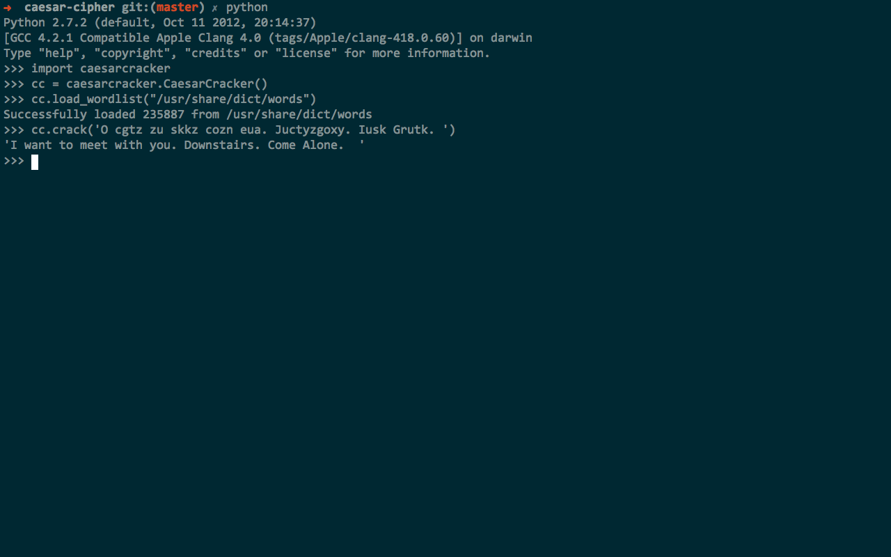

caesarcracker: A Python class for cracking Caesar ciphers
==========================================================

caesarcracker is a Python library for statistical cracking of Caesar ciphertext. It goes through all 26 possible shifts of the ciphertext, and determines which shift leads to the highest percentage occurence of words that exist in the wordlist. Searches through the wordlist are case-insensitive.